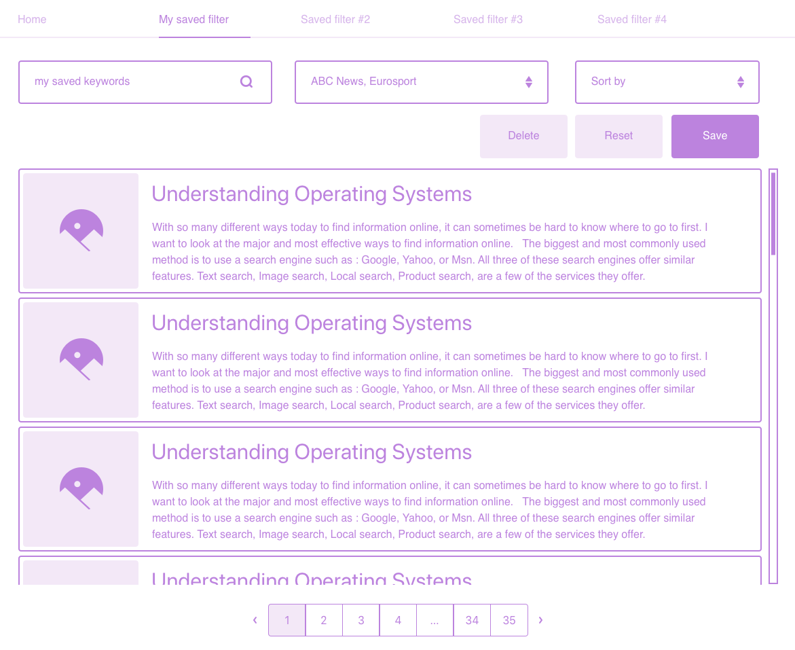

# Interfacewerk News Explorer Test

**Important: Please read this readme until the end!**

Hello! Welcome to our Angular development test. This test has been created in order to assess your level.
In the next few hours, you will be developing a small Angular application.

## Setup

### Docker

We've set everything up so that you can easily get started with Docker. The following command starts a shell session in Docker.

`docker-compose run --service-ports --workdir /myapp app sh`

From there, you can run the usual Angular CLI commands through npm:

* `npm start` continuously builds and serves the app
* `npm run ng g component my-component` scaffolds a new component
* etc.

### Without Docker 

If you don't use Docker. Do the following: `npm install && npm start`

This should install all the needed packages and start a local server.

## Git

If you got this project via a zip file, please do a `git init`. Commit regularily, so that we can see how you use git and what your development workflow was. When you send us back your results, make sure to inlcude the .git folder and remove the node_modules/!

## Angular CLI

Please use the [Angular CLI](https://cli.angular.io/). Two reasons for that:

* it reduces your development time and effort
* it establishes conventions

## Dependencies, APIs and helpers

* Angular 6 with the Angular CLI
* We have pre-installed for you 3 packages: font-awesome, bootstrap (CSS only) and primeng
* Use the `NewsApiService` defined in `services/news-api.service.ts` to use the News API. For further documentation, check https://newsapi.org/docs/endpoints/everything and https://newsapi.org/docs/endpoints/sources
* Use the `FeedStoreService` defined in `services/feed-store.service.ts` to store pre-saved feeds.

## Test

We want to build a news explorer that gets news from [News API](https://newsapi.org/).

* The user must be able to filter news by:
  * a global search
  * a list of sources
* As soon as the user changes the filters, the news must be updated.
* She also must be able to save filters (so called feeds: NewsFeed) and watch the news associated with them later.
* She can see the saved filters in the navigation bar.
* The app must look like  and 

We recommend that you focus on the functionality first. If you have time left, you can of course style the app.

